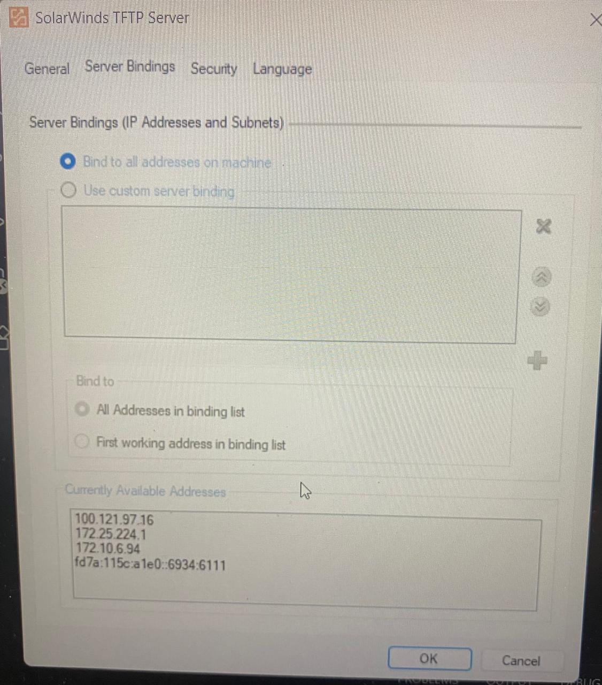
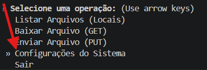
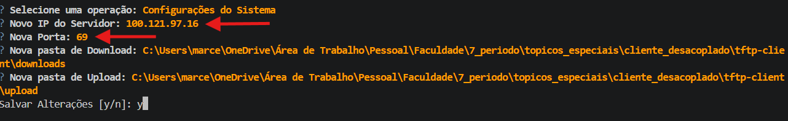
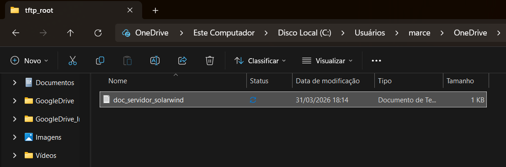
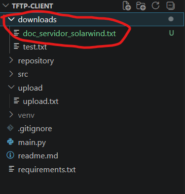
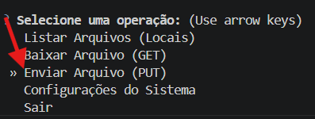
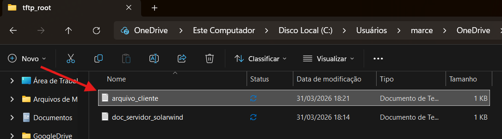

# Cliente TFTP
Um cliente TFTP (Trivial File Transfer Protocol) leve e assíncrono, implementado em Python com asyncio. Suporta operações de download e upload de arquivos.

# Diagrama de Componentes (TFTP Client)


# Estrutura do projeto
```
.
├── main.py                   # Inicia o cliente
│
├── src/                      # Pasta com os modulos do cliente
│
├── downloads/                # Pasta de recebimento de arquivos
│
└── upload/                   # Pasta de envio de arquivos
```
# Como executar
### Pré-requisitos
* Python 3.10+
### Instalar dependências
```
pip install -r requirements.txt
```
### Iniciar cliente
* Em windows
```
python main.py
```
* Em Linux:
```
sudo <python-venv-path> main.py
```
Saída esperada
```
Selecione uma operação: (Use arrow keys)
 » Listar Arquivos (Locais)
   Baixar Arquivo (GET)
   Enviar Arquivo (PUT)
   Configurações do Sistema
   Sair
```

### Configurações do Sistema
O ip padrão para conectar a um servidor é "127.0.0.1:6969"

```
? Selecione uma operação: Configurações do Sistema
? Novo IP do Servidor: 127.0.0.1                                                # Ip do servidor a ser conectado
? Nova Porta: 6969                                                              # Porta utilizada (Normalmente 69)
? Nova pasta de Download: /home/lairu/Documentos/GitHub/tftp-client/downloads   # Pasta que sera direcionado os downloads
? Nova pasta de Upload: /home/lairu/Documentos/GitHub/tftp-client/upload        # Pasta utilizada para upload
```
### Baixar arquivos

```
? Selecione uma operação: Baixar Arquivo (GET)
? Nome do arquivo no servidor: test.tx                                          # Nome do arquivo no servidor para ser baixado
```

### Upload de arquivos

```
? Selecione uma operação: Enviar Arquivo (PUT)
? Nome do arquivo na pasta de upload: upload.txt                                # Nome do arquivo na pasta especificada para fazer upload no servidor
```

# Testes


## Com SolarWind
### 1º passo: configurar ip do server

Ips disponíveis do server



Entrar na configuração do sistema



Alterar o ip para o ip do server




### 2º passo: fazer download
Arquivo do servidor



Fazer o download


Escrever o nome do arquivo


Pronto




### 3º passo: fazer upload
Para fazer o upload:



Arquivo presente no cliente


Arquivo no servidor


